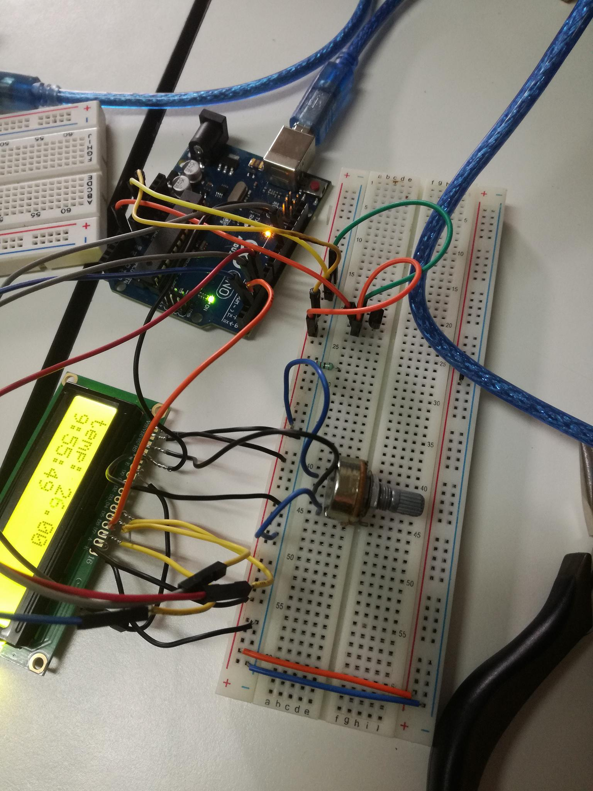
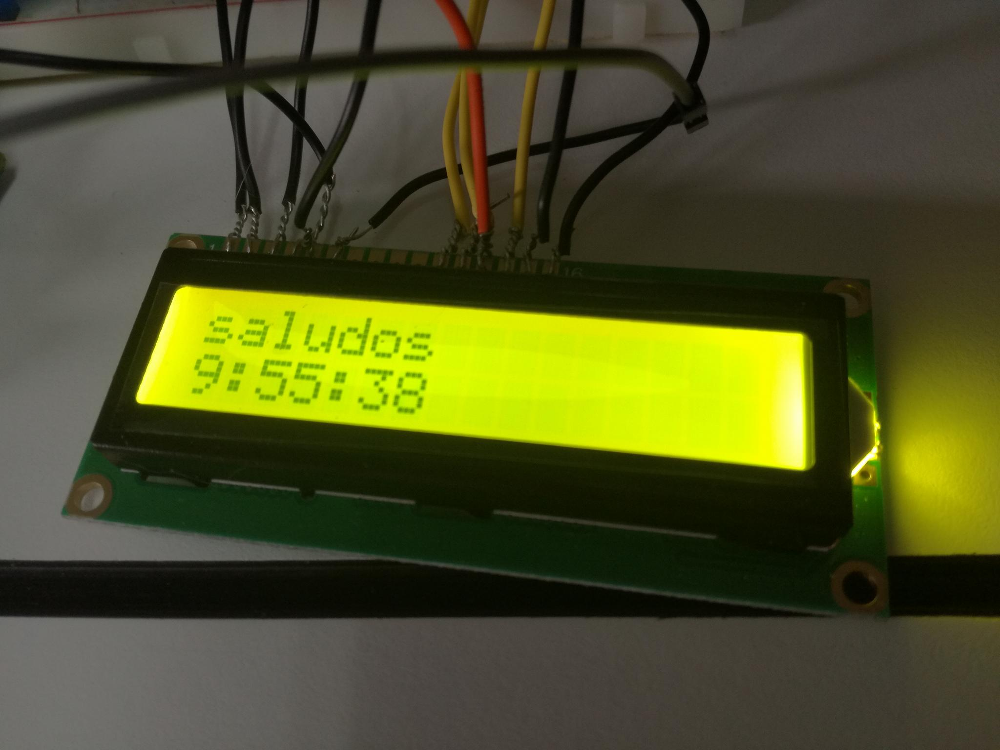
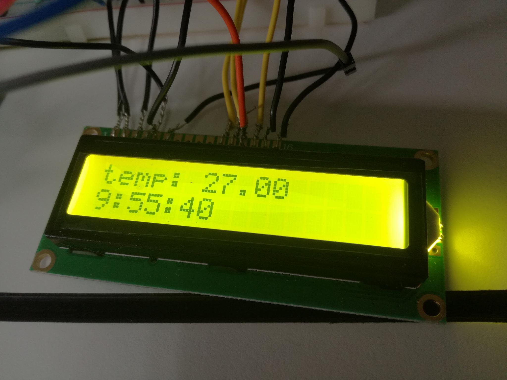
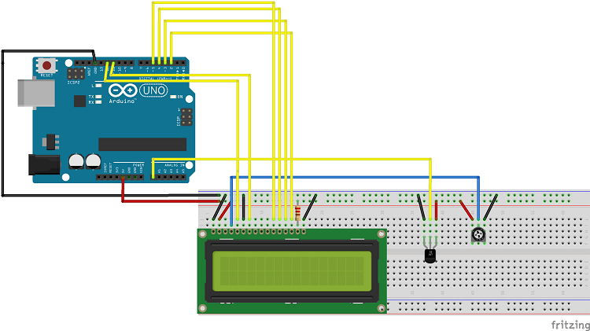
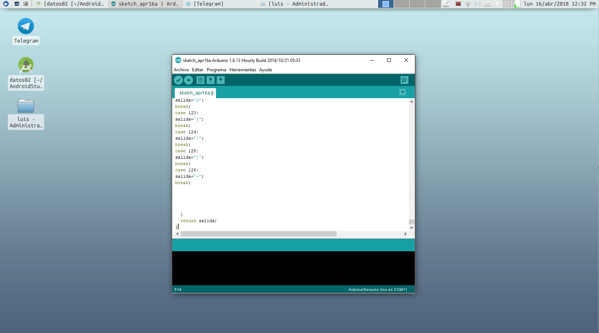

# Display Conexion de java en arduino
El en siguiente proyecto se pretende realizar en java la itereaccion desde un arduino y java mandando un msk en LCD donde se muestra la temperatura, la hora y la fecha actual, y un mensaje(el que el usuario quiera mandar), y todo esto se lograra usando la libreria RXTX para mantener la comunicacion entre el puerto seria y los datos leidos en java

# Materiales
Pararealizar esta pratica necesitaremos los siguientes materiales:
* Arduino UNO
* Cables para protoboard
* Un protoboard
* Sensor de temperatura lm35
* Display LCD de 16X2 con su placa controladora
* Potenciometro de 10K Ohm's
* IDE de desarrolla JAVA

Adicionalmente, necesitaremos tener a nuestra disposicion del Java Developer Kit para lograr la programacion en Java.
Ya sea en un IDE (como netbeans, Oracle, etc) o sólo el compilador por consola, la libreras RXTX y Timer.h para la 
conexion serial y para obtener la hora del sistema del equipo de computo

## Imagen del prototipo

## Imagen del esquema de conexion

## Funcionalidad
EL LCD estara intercalando los mensajes en todo momento, se necesita que correr el proyecto de java para que tenga una hora
el LCD si no moostrara un 00:00:00 cuando se carge la imagen al arduino, una vez que se ejecute el proyecto de java se sincronizara la hora del equipo con el arduino, despues de un tiempo sera intercalando la hora, la temperatura y el mensaje seleccionado desde la interfaz de java, los mensajes se podan personalizar desde la interfaz de java.

## IMPORTANTE!!!!
El  codigo java y arduinno no lo anexare en el readme por la cantidad tan grande de lineas que contiene solo el programade arduino(450 lineas aprox) sin contar el de java, anexare los codigos fuentes.

## Librerias
aqui dejo el link de descarga de las librerias que utilice
https://github.com/PaulStoffregen/Time
